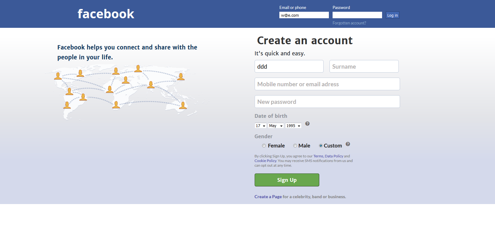
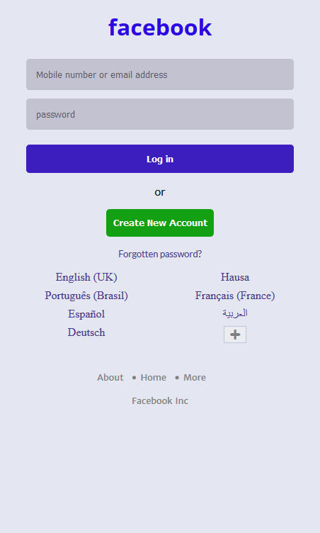

# Facebook Rebrand

_-by Moronfolu Olufunke_

This challenge is a new version of a challenge given to me earlier this year.
The design of this webpage is a clone of the original facebook and I followed all the design as best as I could.

## What this new version includes

-  it is responsive on all screen sizes in accordance to the original site it was developed from.

-  it shows a completely different content based on the device you are using to view it.

## Usage

1. Viewing the page on a laptop or desktop will give you this:
   

2. Viweing the page on a touch device will display this:
   

This project was done with HTML and CSS.
